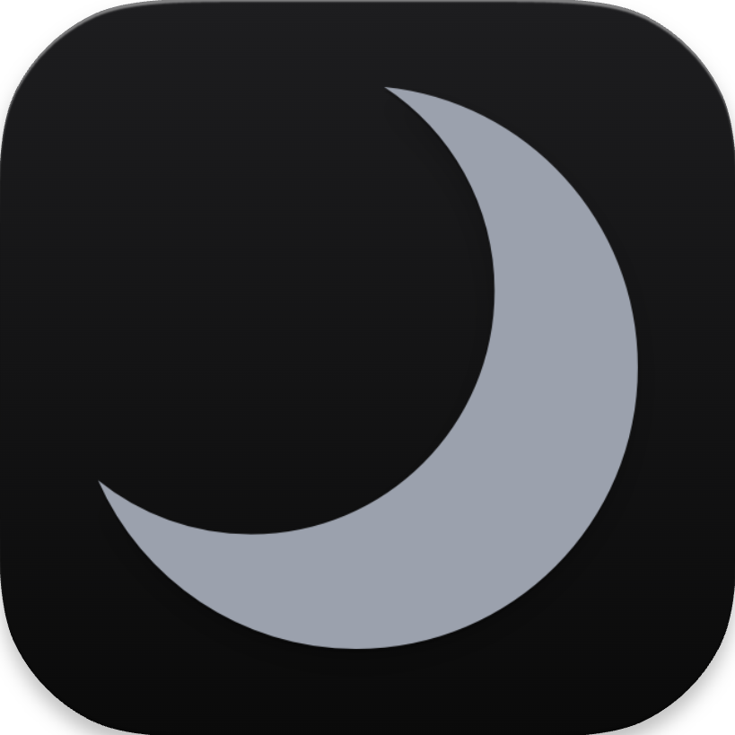

<p align="center">
  
</p>

<h1 align="center">Nocturnal UI</h1>

<p align="center">
  A fast, themeable, tabbed <a href="https://www.hydrogen.lat/">Hydrogen</a> UI built with <b>Tauri</b> + <b>React</b>. It features an <b>Ace</b>-powered editor, smart Lua autocompletion from the Rust/Tauri backend, script execution, and persistent tabs/settings.
</p>

<p align="center">
  
  
  
  
  
  
  
  
  
  
</p>

## Getting Started

### Development

```bash
npm run tauri dev
```

### Installation

You can easily install Nocturnal UI using the provided installation script:

```bash
./public/resourses/install.sh
```

### Building from Source

To build Nocturnal UI from source, use the build script:

```bash
./public/resourses/build.sh
```

## Contact

- Email: lzov@cutetw.ink
- Discord: @lzov 
- Discord Server: https://discord.gg/aCcm2ux2
